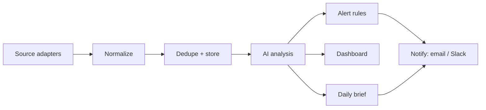

A monitoring product is only as good as the number of places it can watch. Clairwire pulls from news search, RSS and Atom feeds, ordinary web pages, X, Bluesky, YouTube, Reddit, Hacker News and podcasts, and each of those speaks a completely different language. A post on X has likes and a handle. A YouTube video has views and a channel. An RSS item has neither, and sometimes doesn't even have an author.

The easy way to support all of them is to let each platform's quirks flow through the system: a YouTube branch in the analysis code, an X branch in the alert rules, a special case or two in the dashboard. That's quick for the first couple of sources. By the fifth, adding a platform means touching every stage of the pipeline, and every stage has to be retested against all the others.

Clairwire goes the other way. Here are the four decisions that keep it manageable.

## 1. Every source produces the same shape

The shared package defines a single type, `NormalizedMention`, and every source has to produce it. It's the most important file in the codebase:

```ts [packages/shared/src/mention.ts]
export interface NormalizedMention {
  externalId: string    // stable id from the source, used for dedup
  sourceType: SourceType
  sourceName: string    // "TechCrunch", "@handle", …
  url: string
  title?: string
  content: string
  author?: MentionAuthor
  publishedAt: string   // ISO 8601, original publication
  discoveredAt: string  // ISO 8601, when Clairwire first saw it
  metrics?: EngagementMetrics   // likes, shares, comments, views
  raw?: unknown         // the original payload, kept for audit and re-processing
}
```

Fields that only some platforms have, like author details and engagement numbers, are optional. Everything a later stage *needs* is required. And `raw` keeps the original payload, so if the analysis changes later, old mentions can be re-processed from exactly what the source sent.

Deduplication shows why this pays off. Every mention has an `externalId` (a post ID, a video ID, a hash of an article's URL), so "have we seen this before?" is one lookup that works the same way for every source. Nobody had to write dedup logic for YouTube specifically.

## 2. Adapters are the only place a platform exists

Each source is an **adapter**: a class that knows how to talk to one platform and translate what it returns into `NormalizedMention`s. It's the adapter pattern straight out of the textbooks. Here's the interface every adapter implements, trimmed to the essentials:

```ts [apps/api/src/modules/sources/source-adapter.interface.ts]
export interface SourceAdapter {
  readonly sourceType: SourceType
  /** Label, description and config fields for the "add source" form. */
  readonly meta: SourceAdapterMeta
  /** False when, for example, this platform's API key isn't configured. */
  isAvailable?(): boolean
  /** Fetch everything published since the last poll. */
  fetchSince(config: SourceAdapterConfig, since: Date): Promise<NormalizedMention[] | SourceFetchResult>
}
```

Adding a platform means writing one class and registering it. The ingestion code calls `fetchSince`, gets back mentions in a shape it already understands, and carries on. Adapters don't touch the database either. The ingestion worker hands them the client's name, aliases and keywords, and they hand back data. That makes them easy to test against recorded API responses.

Notice that `meta` lives on the adapter itself. The form a user fills in when adding a source (which fields it has, what each one means) is built from it, so there's no second list of sources in the frontend to keep in sync.

## 3. Ask what a source can do, not what it is

Even with a shared shape, sources really do differ in ways the pipeline has to respect. Two examples:

- **Some sources are already filtered to the client, and some aren't.** When the X adapter searches for a client's name, everything it returns at least mentions them. A whole-site RSS feed returns every article that site publishes, most of which have nothing to do with the client, so those results need a relevance check before they're stored.
- **On some platforms, the same text twice means the same post.** If an account on X posts identical text twice in a day, that's a repost for reach, not new coverage, and it should be folded into the first sighting. On YouTube, two videos with the same description are still two different videos.

The tempting fix is an `if (mention.sourceType === 'rss')` somewhere downstream. That's exactly the kind of branch the contract was meant to prevent, and it tends to get copied into three places before anyone notices. Instead, adapters declare **capabilities** in their metadata, and the pipeline reads those:

```ts [apps/api/src/modules/sources/source-adapter.interface.ts]
export interface SourceAdapterMeta {
  // ...
  /** Every mention this adapter emits is already about the client. */
  clientScoped?: boolean
  /** Identical text from the same author within a day is the same post. */
  foldsRepeats?: boolean
}
```

The ingestion code checks `clientScoped`. It never checks `sourceType`. When a new platform comes along, its adapter answers these questions once, and every stage downstream does the right thing without being edited. You've probably heard "program to an interface, not an implementation". This is the same idea applied to data: describe the behavior you care about, and let the pipeline depend on that description.

## 4. The work happens in queues, not in requests

Here's the whole pipeline, from a source being polled to someone getting an email:

::mermaid

::

Each stage has its own BullMQ queue: `ingestion`, `analysis`, `alerts`, `notifications`, `briefings`. When a stage finishes with a mention, it doesn't call the next stage directly. It adds a job to the next queue and moves on. The ingestion worker, for example, stores the new mentions it found and then queues one analysis job per mention.

The HTTP API follows the same rule. A request can add a job or read results, but it never does the slow work itself. When someone clicks "Check now" on a source, the API queues a poll and responds straight away.

If you haven't worked with job queues before, here's what this buys you:

- **A slow step can't hold up a fast one.** An AI call that takes eight seconds ties up one analysis worker, not someone's page load, and not the polling of the next source.
- **Failures stay contained, and they can be retried.** If a platform's API is down, that one poll job fails and runs again later. Nothing else notices.
- **Each stage can be throttled on its own.** A platform that charges per request, or rate-limits hard, can be polled less often without touching anything else. The X adapter can even report when a poll hit its own read limit, and the scheduler uses that to adjust how often that source runs.

## An AI layer you can swap, and a mock you can't ship

Every AI call in the app goes through one interface. Analyzing a mention, writing a daily brief, narrating a report and summarizing text are all methods on `AiProvider`, and no vendor SDK is imported anywhere outside the classes that implement it.

```ts [apps/api/src/modules/ai/ai-provider.interface.ts]
export interface AiProvider {
  readonly name: string
  readonly model: string   // recorded on every analysis

  analyzeMention(mention: NormalizedMention, client: ClientContext): Promise<MentionAnalysis>
  generateBriefing(input: BriefingInput): Promise<GeneratedBriefing>
  generateReport(input: ReportInput): Promise<GeneratedBriefing>
  summarize(text: string, instructions?: string): Promise<string>
  // ...
}
```

The interface describes what the *app* needs (a score, a reason, a brief), not what any particular model's API looks like. There are two implementations. The real one goes through OpenRouter, a service that puts most major models behind one API, so switching models is an environment variable rather than a code change. The other is a mock that returns deterministic fake analyses, so the whole pipeline can run in development and in tests without an API key or a bill.

The interesting part is how the mock is kept out of production. Once it's in the database, a fake sentiment score looks exactly like a real one. If a deploy ever started without its API key and quietly fell back to the mock, customers would be reading invented analysis with nothing to tell them so. So the code that picks the provider refuses to start the app at all in that situation:

```ts [apps/api/src/modules/ai/ai.module.ts]
if (config.aiProvider === 'openrouter') {
  if (config.openRouterApiKey) return new OpenRouterProvider(config)
  if (config.isProduction) {
    throw new Error('AI_PROVIDER=openrouter but OPENROUTER_API_KEY is empty. Refusing to start in production.')
  }
}
else if (config.isProduction) {
  throw new Error('AI_PROVIDER=mock is not permitted in production.')
}
return new MockProvider()   // development and tests only
```

A crash at boot is loud and immediate, and it happens before any user sees anything. A silent fallback is none of those things. That trade is worth making for any "safe default" that stops being safe in production.

::callout{type="note" title="The takeaway"}
None of these four ideas is complicated on its own: one shape, adapters at the edges, capabilities instead of type checks, queues between stages. Together they mean a new platform is one new class, and nothing downstream of it has to change.
::
