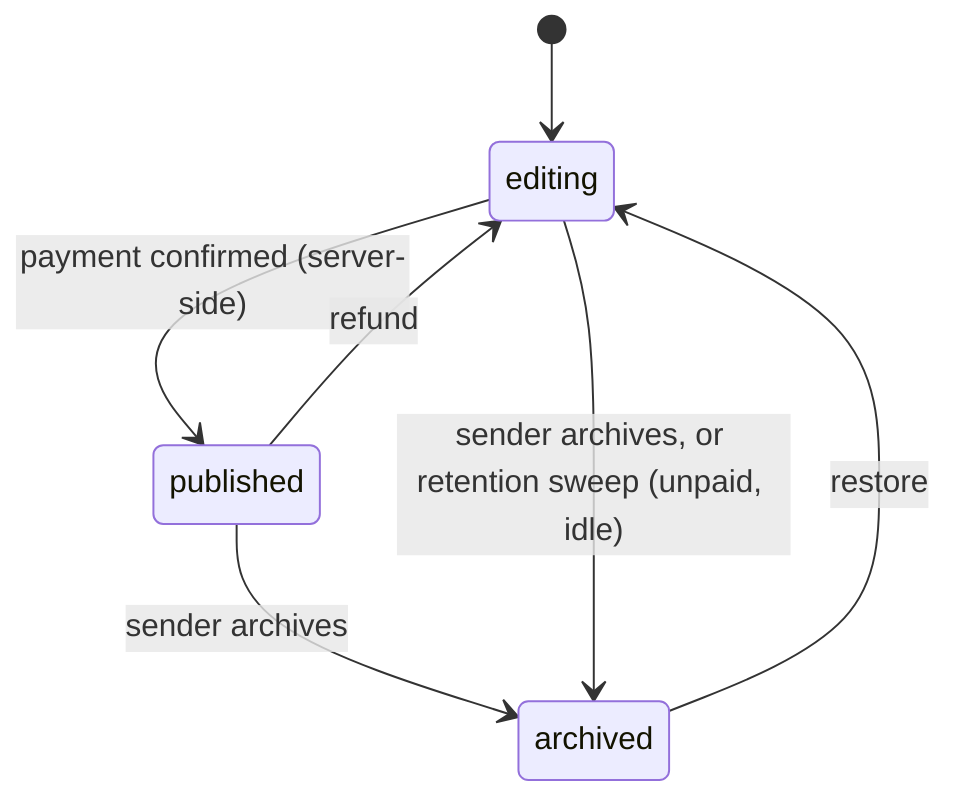

Forevermore has dozens of worlds, and visually they don't have much in common. Some are full Three.js scenes with lighting and cameras. Others are 2D, built from SVG, CSS and GSAP animations. There's a fairground at night, a paper airplane flying past planets, and a fishing trip that warms from morning into golden hour, one catch at a time.

What they do share is where their content comes from. This post is about the decisions that let one person build and maintain that many worlds without every new feature turning into forty separate changes.

## Every world reads one object

Every world, 2D or 3D, receives exactly one object when it starts: the payload. It's defined once, with [zod](https://zod.dev), in the shared package:

```ts [packages/templates/src/payload.ts]
export const experiencePayloadSchema = z.object({
  giftId: z.string(),
  templateSlug: z.string().nullable(),
  occasion: z.string().nullable(),
  recipientName: z.string().nullable(),
  dedication: z.string().nullable(),
  fields: z.record(z.string(), z.unknown()),   // world-specific content
  photos: z.array(experiencePhotoSchema),
  music: experienceMusicSchema.nullable(),
  mode: z.enum(['preview', 'published']),
  // ...
})
```

If you haven't used zod: it lets you describe a shape once and get both a runtime validator and a TypeScript type from it. That's especially handy when the same data crosses a network boundary, because you can check it on arrival instead of trusting it.

That payload gets built in two different places:

- **On the recipient's page**, the server builds it from the published gift in the database.
- **In the editor**, the browser builds it from the form the sender is filling in, and sends it into a preview `<iframe>`, so every edit shows up instantly without anything being saved.

The world can't tell the difference, and it doesn't need to. Two producers, one shape, and every world treats them the same way. The payoff comes each time the editor gets a new kind of content: it's one change to the shared schema and to the code that builds the payload, and every world receives it.

### A live preview over `postMessage`

The preview is worth a closer look, because it's a neat use of a browser API that a lot of developers never touch. The iframe in the editor loads the real viewer app, the same one recipients see. The editor then sends it the payload with `postMessage`, the browser's built-in way for two windows (including a page and an iframe inside it) to send each other data.

Two details make it reliable. First, the iframe announces when it's ready, and the editor waits for that before sending anything, because a message posted to a page that hasn't finished loading is simply lost. Second, every message is sent to one specific origin rather than `'*'`, so the payload can only ever be delivered to the viewer app and never to some other page that ended up in that frame.

The result is a preview that isn't an imitation of the gift. It *is* the gift, running the same code, fed from unsaved form state.

## A video is just a photo

This is my favorite trick in the codebase.

Supporting video sounds like it means teaching every world how to show one: a video texture in the 3D scenes, a `<video>` element in the 2D ones, play buttons, pausing the scene, and dozens of worlds each with their own layout. Instead, a video isn't a new kind of content at all.

When someone uploads a video, the browser grabs a frame from partway through, paints a soft play icon onto it, and saves that image as the memory's photo. The photo schema only gained two optional fields:

```ts [packages/templates/src/payload.ts]
export const experiencePhotoSchema = z.object({
  url: z.string(),          // always an image; for a video, its poster frame
  caption: z.string().nullable(),
  isCover: z.boolean(),
  videoUrl: z.string().nullable().optional(),   // set only for video memories
  videoDurationSec: z.number().nullable().optional(),
})
```

Every world already knows how to hang a photo in a frame, paste it on a billboard or tuck it into a locket, so a video rides along in the same slot with no changes to any world. When the recipient taps it, the lightbox that every photo already uses notices `videoUrl` and plays the film instead. And because every world already pauses itself while the lightbox is open, "the scene stops so you can watch" worked everywhere at once, for free.

The new fields are optional *and* nullable on purpose, so gifts saved before video existed still pass validation. Whenever you extend a contract that already has data behind it, the new fields need to be ones the old data can leave out.

## Assets written as code

The shared asset library ships almost no 3D files: no packs of `.glb` models, no texture bundles. A reusable asset here is a small TypeScript module that *builds* a mesh or an SVG from a palette and a few shape parameters. A lantern is a function. A tree is a function that takes a trunk color, a canopy color and a height.

That one choice pays off in several places:

- Nothing licensed ever ships to a browser, because there's nothing to license.
- There are no large binaries slowing down page loads or edge deploys.
- Re-theming a world is a palette change, not a trip back into a 3D tool to re-export everything.

The library has close to a hundred of these kits. A few were written up front as infrastructure (palette helpers, particle systems, cut-paper frame shapes), but most were pulled out of a world after it was finished. When the next world needs a similar prop, it starts from something that already works.

There's one deliberate exception. For Deep Reef Dive, I wanted creatures and coral with hand-shaped silhouettes that are hard to get out of code, so that world's models are made in Blender and loaded as glTF files. It's a trade I made on purpose for one scene, not a change of default. It's also a useful reminder that a rule like "assets are code" exists to serve the product, not the other way around.

### One place for every color

Each world keeps its whole look in one theme module, built from layered overrides. A base palette holds the fully art-directed default. The theme the sender picks overrides part of it. The occasion (a birthday, a retirement, a memorial) adjusts accents on top, like the pacing, a line of text, or whether certain effects play at all. Here's the real resolver from the fishing world:

```ts [apps/experience/app/templates/gone-fishing/theme-palette.ts]
export function resolveFishingLook(occasion: string | null, tripTheme: string): FishingLook {
  const theme = THEME_LOOKS[tripTheme] ?? THEME_LOOKS['summer-lake']!
  const palette: FishingPalette = { ...BASE_PALETTE, ...(theme.palette ?? {}) }
  const accents: FishingAccents = {
    ...DEFAULT_ACCENTS,
    ...((occasion && OCCASION_ACCENTS[occasion]) || {}),
  }
  return { palette, dayArc: theme.dayArc, accents }
}
```

Every other file in the world reads its colors from the object this returns, and none of them define a color inline. It's an easy rule to break with one quick hardcoded hex value, but keeping it is what makes a new theme a config change instead of a hunt through every file.

## A lifecycle that stays boring on purpose

A gift only ever has three states:

::mermaid

::

The transitions follow what the product promises. A paid gift never expires, and only two things take it off the recipient's link: a refund, or the sender choosing to archive it. Restoring an archived gift always lands in `editing`, never straight back in `published`, so nothing becomes public again without the sender seeing it first.

The editor also shows a checklist of what a gift is still missing (enough photos, a required field, a cover image) as a progress ribbon. That checklist is guidance only. It never disables the publish button, and the code that computes it is kept apart from anything that decides whether checkout is allowed. The reason is subtle: if a well-meaning future change added "require X before publishing" to the checklist, it could lock someone out of a gift they had already paid for. Keeping helpful hints and hard rules in different places makes that mistake hard to make.

## No trackers on a gift

The recipient's page has no tracking cookies and no third-party scripts. View counts are recorded on the server, as a side effect of requests that were happening anyway, instead of by an analytics script running in the recipient's browser. A gift is something personal that someone made for you, and it shouldn't behave like an ad.

::callout{type="tip" title="The takeaway"}
A lot of the leverage here came from deciding what *not* to build: no new content type for video, no asset files, no extra gift states, no analytics scripts. Each of those decisions removed a whole category of work from every world that came after.
::
