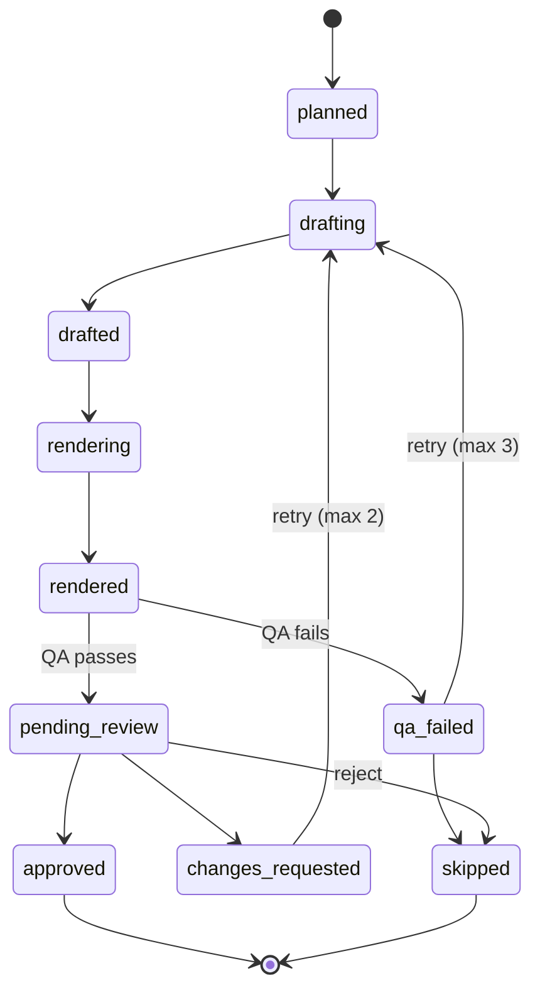

Running a product alone means doing its marketing alone too, and social media wants a steady stream of posts. Autopilot is the tool I built to take over the production side. It plans a week of posts, writes the copy, renders the finished images and videos, runs a quality check, and writes a digest for me to review. My part shrinks to approving or rejecting a batch.

It lives in its own repository, with its own Postgres database, and its only connection to the main platform is a folder path, so it can read assets from a local checkout. A marketing tool has no business sharing a deploy or a database schema with the product it promotes. If Autopilot breaks, the product doesn't notice.

::link-card{title="Source on GitHub" description="forevermore-autopilot: pipeline core, CLI, and the stage state machine." to="https://github.com/Redoni18/forevermore-autopilot"}
::

## Five stages

Every run moves content through the same five stages, in order:

1. **Plan.** Pick ideas for the coming week from an idea database, scored by quality and by how recently each one was used. This stage is deterministic: same inputs, same plan, no AI involved.
2. **Generate.** Write captions, hashtags and text overlays.
3. **Render.** Produce the finished image or video.
4. **QA.** Check the result against a set of rules.
5. **Digest.** Write an HTML summary of everything waiting for review.

Each stage works on a specific date, and a finished `(stage, date)` pair counts as done. Running it again logs a skip and does nothing, unless you pass `--force`. That makes it safe to trigger stages from a scheduler without worrying about duplicate work if something fires twice. In other words, every stage is **idempotent**: running it once or five times ends in the same place.

## The status is a state machine, not a flag

Every piece of content has a status, and the legal moves between statuses are written down in one table:

```js [src/state/machine.mjs]
export const TRANSITIONS = {
  planned: ['drafting', 'skipped'],
  drafting: ['drafted', 'skipped'],
  drafted: ['rendering', 'skipped'],
  rendering: ['rendered', 'skipped'],
  rendered: ['pending_review', 'qa_failed'],
  qa_failed: ['drafting', 'skipped'],
  pending_review: ['approved', 'changes_requested', 'skipped'],
  changes_requested: ['drafting', 'skipped'],
  approved: ['scheduled', 'skipped'],
  // ... scheduling and publishing states
}
```

That table is the single source of truth. Every status change in the codebase goes through one function, which looks the move up in the table and throws if it isn't there. You can't accidentally jump a post from `drafted` straight to `approved`, because no code path allows it. It's also one of the first things the tests check: illegal transitions get tested as carefully as legal ones.

Here's the production and review part of that lifecycle as a diagram:

::mermaid

::

Retries are capped. A post that fails QA goes back to drafting at most three times, and a post I send back with notes can be regenerated at most twice. After that, it's skipped. Without those caps, a bad prompt or a flaky renderer could loop all night, burning time and API credits while I'm asleep.

## Surviving a crash halfway through

Anything that runs unattended will eventually crash in the middle of a job, or get started twice at the same time. The real question is what state it leaves behind.

Autopilot's answer is a **compare-and-swap** (CAS) update. Instead of "set this post's status to `rendering`", every transition says "set this post's status to `rendering`, *but only if it's currently `drafted`*". In SQL, that's just an extra condition in the `WHERE` clause:

```sql
update autopilot.content_items
   set status = 'rendering', updated_at = now()
 where id = $1
   and status = 'drafted'      -- the status we expect it to be in
returning *;
```

If the update changes one row, the transition happened. If it changes zero, something else moved the post first (or it doesn't exist), and the code raises a conflict instead of carrying on with stale assumptions. Two processes can race to render the same post, and exactly one of them wins. Postgres makes the check and the write a single atomic step, so there's no gap between "check the status" and "change it" for another process to slip into.

This is also why crashes are boring. The code never assumes a post is wherever the process last left it. After a restart, it reads the real status from the database and picks up from there. If you've come across **optimistic locking**, this is it: instead of locking a row while you work on it, you check at write time that nobody changed it in the meantime.

## Building the skeleton before the expensive parts

The three least predictable parts of the system, where the copy gets written, how a post gets judged, and where state is stored, are injected rather than hard-coded. Each one had a simple default that shipped first:

| Seam | What shipped first | The real implementation |
| --- | --- | --- |
| Store | A plain file store | A Postgres store, once the schema existed |
| Copywriting ("brain") | A fixture that returns fixed sample copy | A driver backed by a real model |
| QA | A check that always passes | A real lint engine |

That order was deliberate. The state machine, the CLI, retries with backoff, and the CAS transitions were all written and tested against those stand-ins before a single API key was involved. `node --test` covers the state machine (illegal moves included), CAS races, the planner's determinism, retries, and a full end-to-end run of the pipeline with every expensive part stubbed out. When the real model driver arrived, it replaced one seam, and none of the orchestration code around it had to change.

The idea travels well beyond pipelines. If you can make the expensive or unpredictable part of a system swappable, you can build and test everything around it first, cheaply and deterministically, and plug the real thing in last.

## Very few dependencies

The core is written against the Node standard library. Argument parsing, the stage runner and the review web UI are all hand-rolled, and the only runtime dependency is the `postgres` driver that the Postgres store needs. That was a constraint I set going in. A tool that runs on a schedule while nobody's watching shouldn't break overnight because some transitive dependency shipped a bad patch release.
