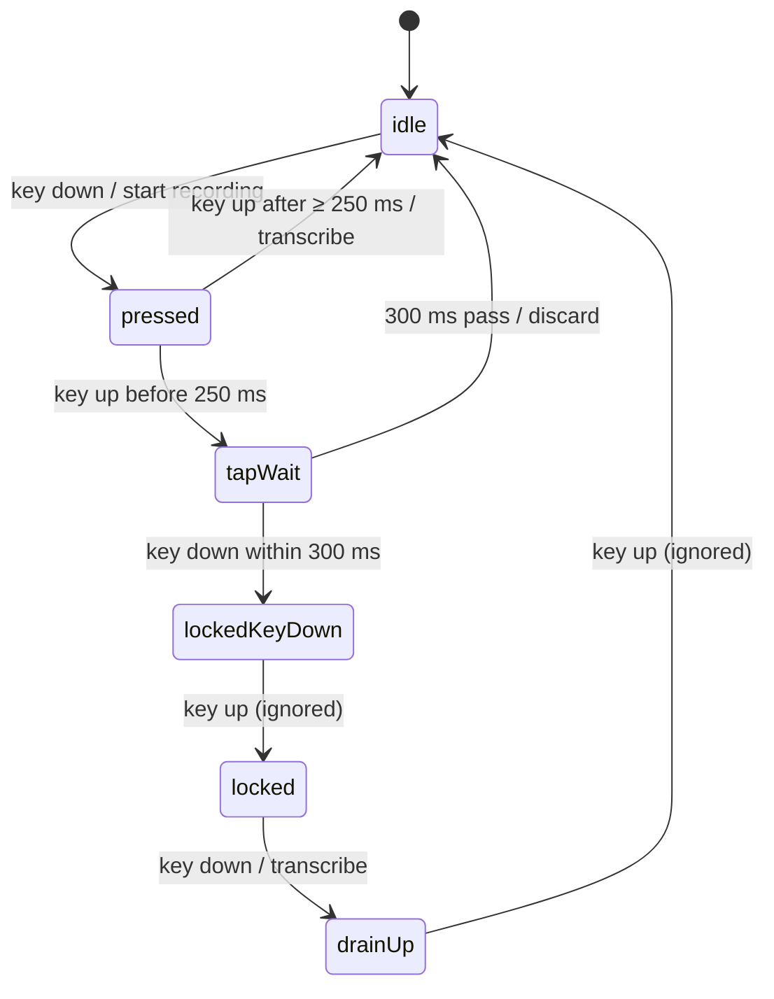

OpenWisper has one hotkey (`fn` by default) and two ways to use it:

- **Hold it** while you talk, and let go when you're done. That's push-to-talk, the one you'd use for a quick message.
- **Double-tap it** to start a hands-free session. You can take your hands off the keyboard and talk for as long as you like. One more tap stops it.

On top of that, `Esc` cancels at any point, and a single accidental tap should do nothing at all.

Most dictation apps make you choose one of these modes in the settings. I wanted both on the same key, without the app ever asking which one you meant. It sounds like a small detail, but it's where most of the tricky logic in the app lives. It's also a good example of a problem that gets much simpler once you model it as a state machine.

## Why a few booleans aren't enough

The first instinct for something like this is a handful of variables: `isRecording`, `isLocked`, `lastTapTime`, maybe a timer. Each event handler checks some combination of them and flips others. That covers the happy path. Then the edge cases arrive:

- When you tap to *stop* a hands-free session, the key also comes back up a moment later. What stops that release from being read as the end of a push-to-talk?
- The second tap of a double-tap also has a release. Why doesn't that one stop the session it just started?
- What happens if `Esc` arrives between a key press and its release?

With loose booleans, each of these questions turns into another `if` somewhere, and it gets hard to answer "what can happen next?" by reading the code. A state machine answers that question directly. The app is always in exactly one named state, and each state lists the events it reacts to and where they lead. Any event that isn't on the list is ignored, on purpose.

## The states

This is the machine behind the default mode, which is called `flow` in the config. (There are also plain `hold` and `toggle` modes, for people who only want one gesture.) `Esc` from any recording state goes straight back to `idle`; I left those arrows out to keep the diagram readable.

::mermaid

::

Let's go through the decisions that shaped it.

### Start recording before you know what the press means

The first key press turns the microphone on straight away, before the app knows whether this will be a hold or a tap. That seems backwards at first, but it's what makes the double-tap safe. If you double-tap and start talking immediately, whatever you said between the first and second tap is already in the recording. The recording runs from the very first press to the end, as one continuous clip, so locking the session never cuts anything off.

The cost is that a stray tap briefly opens the microphone. That's what `tapWait` is for: if no second tap arrives within 300 ms, the audio is thrown away without being transcribed, and it's as if nothing happened. As a second safety net, any clip shorter than 0.4 seconds is discarded, however it was produced.

### Hold or tap? Measure the release

When the key comes back up in `pressed`, the controller checks how long it was held. 250 ms or more means you were holding it to talk, so the recording stops and goes off to be transcribed, exactly like a classic push-to-talk. Anything shorter was a tap, so the machine moves to `tapWait` and gives you 300 ms to tap again.

Both numbers are configurable (`minHoldMs` and `doubleTapWindowMs`). The double-tap window is capped at five seconds in code, because the microphone is open for as long as that window is. A typo in a config file shouldn't be able to leave it recording indefinitely.

### Two states whose only job is to ignore something

`lockedKeyDown` and `drainUp` are my favorite part of this machine, because they look pointless until you see what breaks without them.

Think about the second tap of a double-tap. The key goes down, which locks the session, and a moment later it comes back up. Without a dedicated state, that release would land in `locked`, and then what? If it were treated like the end of a hold, it would stop the session you had just started. So `lockedKeyDown` means "locked, but the key that locked it is still physically down". Its only job is to swallow the next key-up.

`drainUp` is the same idea on the way out. When you tap to stop a hands-free session, the press stops it, and the release that follows must not start anything new. `drainUp` absorbs that release and then goes back to `idle`.

Here's the release handler, slightly trimmed. Once the state carries the context, there's very little left for it to decide:

```swift [Sources/Spine/DictationController.swift]
private func flowHotkeyUp() {
    switch flowPhase {
    case .pressed:
        let heldMs = (Date.timeIntervalSinceReferenceDate - recordingStartedAt) * 1000
        if heldMs >= Double(config.hotkey.minHoldMs) {
            flowPhase = .idle
            finishRecording(enforceMinimumHold: true)   // push-to-talk
        } else {
            flowPhase = .tapWait
            armTapWaitWindow()                          // maybe a double-tap
        }

    case .lockedKeyDown:
        flowPhase = .locked   // the locking tap's own release: ignore it

    case .drainUp:
        flowPhase = .idle     // the stopping tap's own release: ignore it

    case .idle, .tapWait, .locked:
        return                // no key was down as far as we know
    }
}
```

Each case is one or two lines. When something behaves strangely, I can trace the diagram with a finger and find the transition that's wrong, instead of reasoning about four booleans at once.

## A timer you can take back

The 300 ms window is a timer, and timers come with a classic bug: you cancel one, but it had already fired and its callback is queued to run anyway. Here, that would mean a double-tap that correctly locks the session, followed a split second later by the expired window throwing the recording away.

The window is a Swift `Task` that sleeps and then calls back, and it's guarded in two ways. Cancelling the task covers the normal case. For the race, a counter called `tapWaitGeneration` goes up by one every time a window is armed or cancelled. Each callback remembers the number it was created with, and if that number isn't the current one when it finally runs, it does nothing:

```swift [Sources/Spine/DictationController.swift]
private func tapWaitWindowExpired(generation: Int) {
    guard generation == tapWaitGeneration else { return }   // a stale window
    guard case .tapWait = flowPhase else { return }
    cancelRecording()   // no second tap: it was an accidental press
}
```

It's a small pattern, and you'll find a use for it anywhere a delayed callback can outlive the reason it was scheduled: debounced search requests, toasts that hide themselves, retries.

## Keep the listener dumb

One design choice made all of this testable. The keyboard listener knows almost nothing. It uses a macOS event tap (`CGEventTap`) to watch key events across the whole system, and all it reports is "down", "up" or "Esc". It has no idea about modes, timings or recordings.

Every decision is made in `DictationController`, and the controller only talks to the things around it (the recorder, the transcriber, the text inserter, the on-screen indicator) through small Swift protocols. So the unit tests can drive the state machine with fake key events and a fake recorder, and check what happened, with no microphone, keyboard or model involved. In a test, a double-tap is just `hotkeyDown()`, `hotkeyUp()`, `hotkeyDown()`.

## A ceiling for hands-free mode

A hands-free session has no key release coming, so it needs another way to end if you forget about it. The recorder has a hard cap, 10 minutes by default. When it's reached, the session stops and transcribes what it caught, exactly as if you had tapped the key yourself. Walking away from your desk mid-sentence shouldn't leave a microphone on for the rest of the afternoon.

::callout{type="tip" title="The takeaway"}
If you catch yourself adding a third boolean to track which mode you're in, it's usually time to write the states down by name. Once they're named, "what happens if the user does X here?" becomes a question you can answer by looking at one diagram.
::
